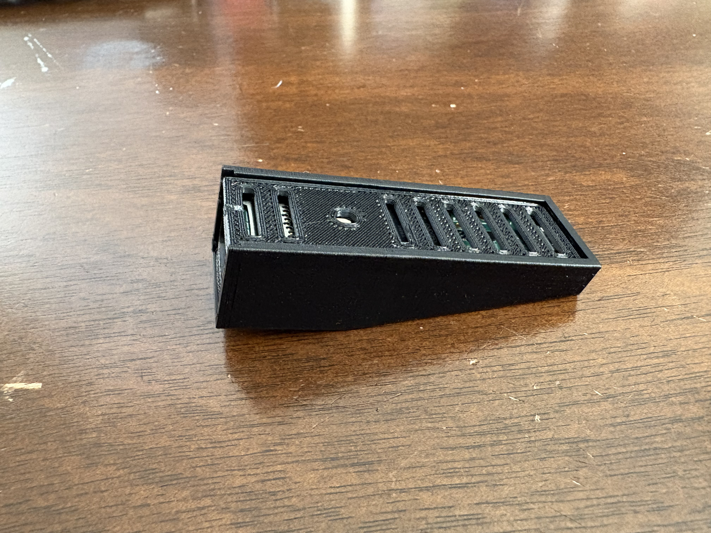
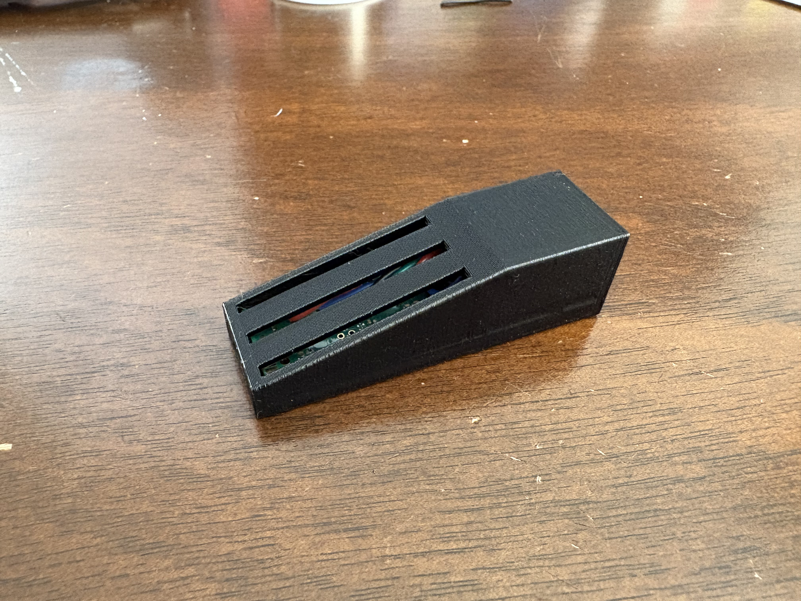
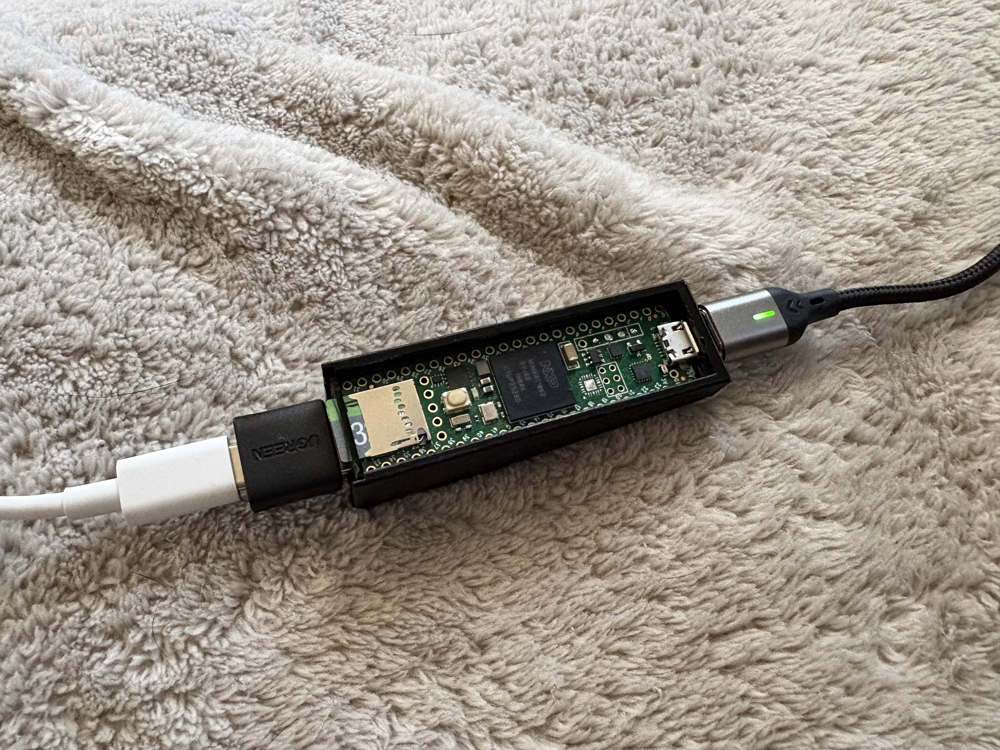
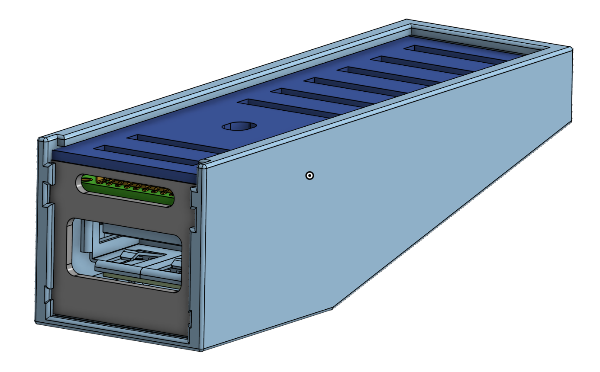
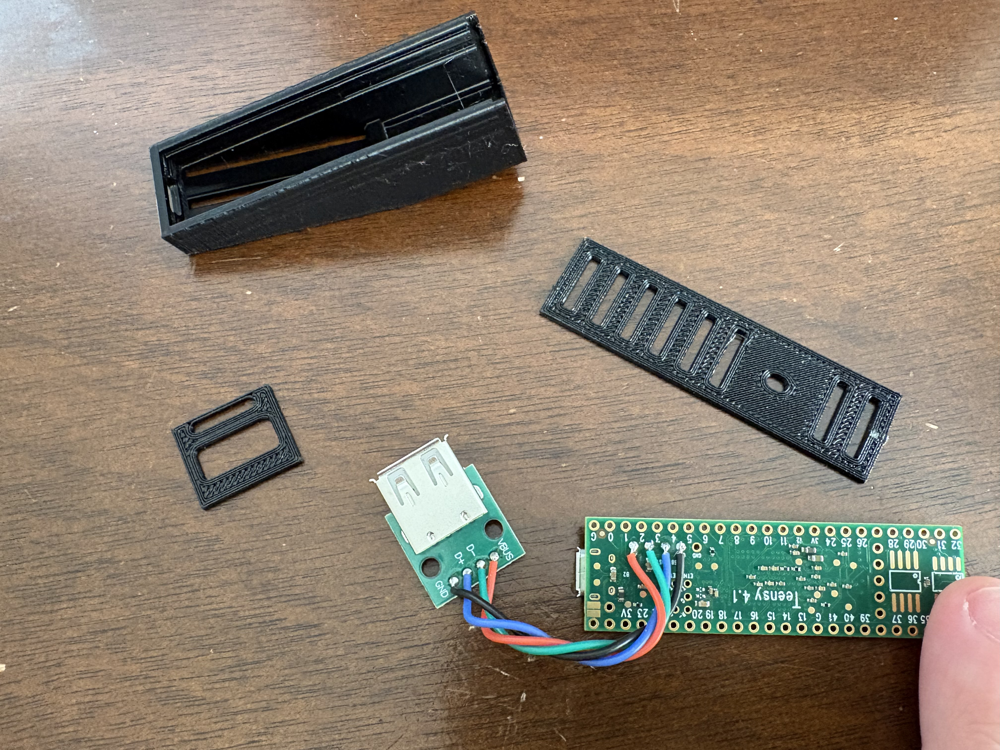
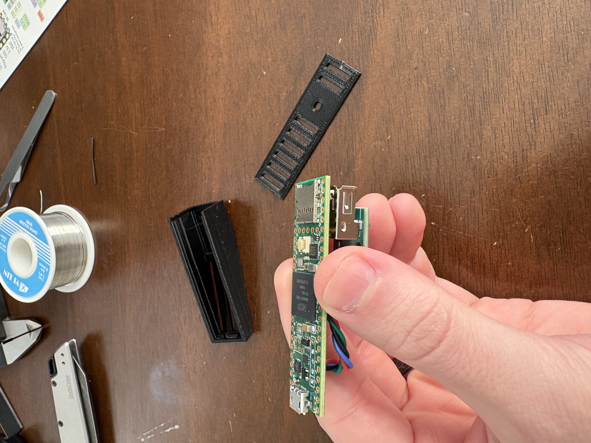
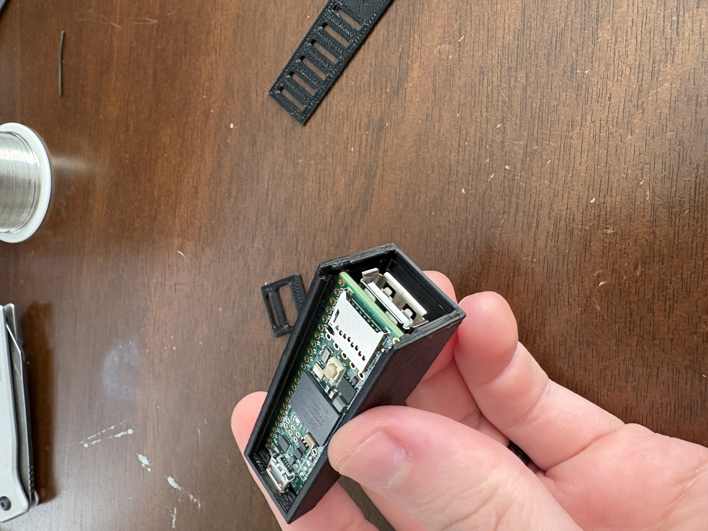
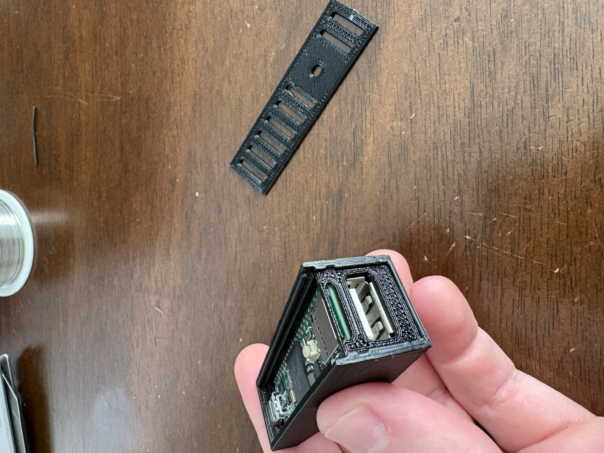
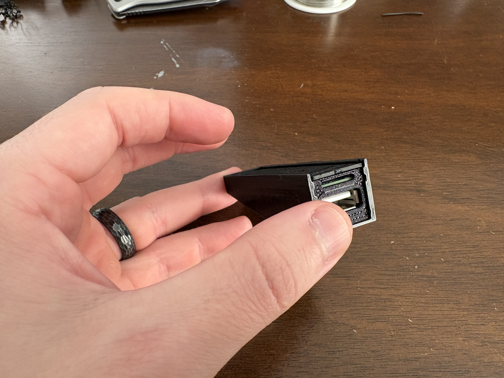

# Teensy MIDI to HID Keyboard Translator

A hardware-based MIDI to keyboard translator for Teensy 4.1 that allows you to use MIDI instruments in video games without any software on your gaming PC. To your PC this device just appears as a genric USB keyboard!

### Finished Product

 



## 3D Printed Dongle Enclosure



<a href="https://cad.onshape.com/documents/d447ba38ceae90fc1a025caa/w/b02970f7e3dbf0d5ded550ad/e/2d1d9289cd4d8826bf3fcb10?renderMode=0&uiState=693ef2ecd4744c235e894ded" target="_blank">
  
</a>

## Hardware Setup

- **Teensy 4.1** microcontroller
- **3D Printed USB Case/Enclosure** (recommended) - see enclosure design above
- **USB Host Port** (female USB A) - **⚠️ REQUIRED: Must be soldered to USB Host pins on Teensy 4.1** - connects to MIDI devices
- **USB Device Port** (micro USB) - connects to gaming PC
- **SD Card** (optional, for configuration) - insert into Teensy SD card slot

> **Important:** The Teensy 4.1 does not have a built-in USB Host port. You must solder a female USB A port to the USB Host pins on the Teensy board. The USB Host pins are located on the bottom of the Teensy 4.1 board.

## Assembly Instructions

Follow these steps to assemble your MIDI to HID translator (everything just slides together):

    

## Features

- ✅ USB MIDI Host support (up to 4 MIDI devices simultaneously)
- ✅ HID Keyboard output (appears as generic keyboard to PC)
- ✅ Configurable MIDI note to keyboard key mappings via SD card
- ✅ Support for modifier keys (Shift, Ctrl, Alt, Meta/Win)
- ✅ Polyphonic chord support (up to 6 simultaneous keys)
- ✅ **Fast-press mode** for games that don't recognize held keys
- ✅ **SD card configuration** - no PC software needed!
- ✅ User-friendly key names (no hex codes needed!)
- ✅ Zero software required on gaming PC
- ✅ Built with PlatformIO for modern development workflow

## Mapped Games

Pre-configured mapping files are available in the `mappings/` folder:

- **Where Winds Meet**
  - 36-key mode (`WWM36_MAPPINGS.txt`) - Full chromatic scale with modifier keys
  - 21-key mode (`WWM21_MAPPINGS.txt`) - Natural notes only

To use these mappings, copy the desired file to your SD card root and rename it to any name containing "MAPPINGS" with a `.txt` extension.

## Prerequisites

- [PlatformIO IDE](https://platformio.org/install/ide?install=vscode) (VS Code/Cursor extension) or [PlatformIO Core](https://platformio.org/install/cli)
- Teensy 4.1 board
- USB cable (micro USB)

## Installation & Building

### Using PlatformIO (Recommended)

1. **Install PlatformIO**
   - **VS Code/Cursor**: Install the "PlatformIO IDE" extension
   - **CLI**: Follow [PlatformIO installation guide](https://platformio.org/install/cli)

2. **Open the Project**
   - Open this folder in VS Code/Cursor
   - PlatformIO will automatically detect the project

3. **Build & Upload**
   - Click the PlatformIO icon in the sidebar
   - Click **Build** (checkmark icon) to compile
   - Click **Upload** (arrow icon) to flash to Teensy
   - Or use the terminal: `pio run --target upload`

4. **Monitor Serial Output**
   - Click **Monitor** (plug icon) or use: `pio device monitor`
   - Baud rate: 115200 (configured in `platformio.ini`)

### Using Arduino IDE (Alternative)

If you prefer Arduino IDE:

1. Install [Arduino IDE](https://www.arduino.cc/en/software)
2. Install [Teensyduino](https://www.pjrc.com/teensy/td_download.html)
3. Copy `src/main.cpp` to `TeensyMidiToHID.ino` (remove `#include <Arduino.h>`)
4. Copy `include/MidiConfig.h` to the same folder
5. Select **Board: Teensy 4.1** and **USB Type: Keyboard**
6. Upload

## Configuration

### Quick Start

**Step 1: Flash the firmware** (if you haven't already)
- Build and upload the code to your Teensy 4.1 (see Installation & Building above)

**Step 2: Prepare your SD card**
- Format SD card as FAT32
- Copy `CONFIG.TXT` to SD card root (optional, uses defaults if missing)
- Copy a mapping file to SD card root (any `.txt` file containing "MAPPINGS" in the filename)
  - Examples: `MAPPINGS.txt`, `MY_GAME_MAPPINGS.TXT`, `custom_mappings.txt`
  - See `sd_card/` folder for example files and `mappings/` folder for templates

**Step 3: Setup hardware**
- **⚠️ IMPORTANT:** Ensure you have soldered a female USB A port to the USB Host pins on your Teensy 4.1 (if not already done)
- Insert the prepared SD card into Teensy 4.1 SD card slot
- Connect your MIDI device to the soldered USB Host port (female USB A) on Teensy
- Connect Teensy to your computer via micro USB cable

**Step 4: Power on**
- Configuration loads automatically from SD card on startup!

See the `sd_card/` folder for example files and `mappings/` folder for mapping templates.

## How It Works

1. **On startup:** Teensy reads `CONFIG.TXT` and mapping file from SD card
2. **MIDI input:** MIDI devices connect to the soldered USB Host port, Teensy receives Note On/Off messages
3. **Mapping lookup:** Code looks up the configured mapping for each MIDI note
4. **Key output:** Keyboard key presses/releases are sent via USB HID to the PC
5. **Fast-press mode:** If enabled, keys are pressed/released quickly (configurable duration)
6. **Polyphony:** Supports up to 6 simultaneous keys (chords)
7. **Gaming PC:** Sees only a generic USB keyboard - no MIDI software needed!

## Advanced Configuration

### Configuration File (CONFIG.TXT)

Create a `CONFIG.TXT` file on your SD card with these settings:

```ini
# Fast-press mode: If true, keys are pressed/released quickly regardless of MIDI duration
FAST_PRESS_MODE=true

# Press duration: How long to hold keys in fast-press mode (milliseconds)
# 0 = immediate press/release (recommended for most games)
# 1-1000 = hold for specified duration
PRESS_DURATION=0
```

**Settings:**
- `FAST_PRESS_MODE` - `true`/`false`, `1`/`0`, `ON`/`OFF`, `YES`/`NO` (case-insensitive)
- `PRESS_DURATION` - `0` to `1000` milliseconds

If `CONFIG.TXT` is missing, defaults are used: `FAST_PRESS_MODE=true`, `PRESS_DURATION=0`

### Fast-Press Mode Explained

**Normal Mode** (`FAST_PRESS_MODE=false`):
- Keys are held down as long as the MIDI note is held
- Useful for games that recognize held keys

**Fast-Press Mode** (`FAST_PRESS_MODE=true`):
- Keys are pressed and released quickly, regardless of MIDI note duration
- `PRESS_DURATION=0`: Immediate press/release (recommended)
- `PRESS_DURATION=50`: Hold for 50ms then release
- Useful for games that don't recognize held keys (like Where Winds Meet)

### Creating Custom Mappings

To create your own mapping file:

1. **Copy a template** from `mappings/games/where_winds_meet/` or create a new file
2. **Use format:** `MIDI_NOTE=KEY_NAME` (one per line)
3. **Add comments** with `#` for documentation
4. **Save with any name** containing "MAPPINGS" and `.txt` extension (e.g., `MY_GAME_MAPPINGS.txt`) on SD card root

#### Mapping File Format

Mapping files use a simple `MIDI_NOTE=KEY_NAME` format:

**Basic Format:**
```
# Comments start with #
60=H      # MIDI note 60 (Middle C) -> H key
62=J      # MIDI note 62 (D4) -> J key
64=K      # MIDI note 64 (E4) -> K key
```

**With Modifiers:**
```
60=SHIFT+A    # MIDI note 60 -> Shift+A
62=CTRL+SPACE # MIDI note 62 -> Ctrl+Space
64=ALT+F1     # MIDI note 64 -> Alt+F1
```

**Inline Comments:**
```
60=H  # Middle C -> H key
62=J  # D4 -> J key
```

#### Supported Key Names

**Letters:** `A` through `Z` (case-insensitive)

**Numbers:** `0` through `9`

**Special Keys:**
- `SPACE` or `SPC` - Spacebar
- `ENTER` or `RETURN` - Enter key
- `ESC` or `ESCAPE` - Escape key
- `TAB` - Tab key
- `BACKSPACE` or `BS` - Backspace

**Modifiers (for combinations):**
- `SHIFT` - Left Shift
- `CTRL` or `CONTROL` - Left Ctrl
- `ALT` - Left Alt
- `META` or `WIN` or `CMD` - Windows/Command key

**Modifier Format:**
- `SHIFT+KEY` or `KEY+SHIFT` - Both formats work
- Example: `SHIFT+A` or `A+SHIFT` both map to Shift+A

#### MIDI Note Reference

Standard MIDI notes:
- C4 (Middle C) = 60
- C#4 = 61
- D4 = 62
- ... and so on

You can use any MIDI note from 0-127.

#### Examples

**Basic mapping:**
```
# My Custom Game Mapping
48=Z      # C3 -> Z
50=X      # D3 -> X
60=A      # C4 -> A
62=S      # D4 -> S
```

**With modifiers:**
```
60=A          # C4 -> A
61=SHIFT+A    # C#4 -> Shift+A
62=S          # D4 -> S
63=CTRL+D     # D#4 -> Ctrl+D
```

See `mappings/games/where_winds_meet/` for complete mapping file examples.

### Polyphony and Chords

The device supports up to **6 simultaneous keys** (polyphony). When playing chords:

- Keys with the same modifier are sent together (fastest)
- Keys with different modifiers are batched to preserve order
- Order of MIDI input is preserved in output

**Example:** Playing MIDI notes 60, 61, 62 mapped to `A`, `SHIFT+B`, `C`:
- First batch: `SHIFT+B` (modifier key)
- Second batch: `A` and `C` (normal keys)
- All sent very quickly to preserve timing

### USB Type Configuration

USB type is configured in `platformio.ini` via `build_flags`:
- Current: `-DUSB_KEYBOARDONLY` (Keyboard only)
- Other options: `-DUSB_SERIAL`, `-DUSB_MIDI`, etc.

### Multiple MIDI Devices

The code supports up to 4 MIDI devices simultaneously. Each device's MIDI messages are processed independently.

## Technical Details

- **MIDI Support**: USB MIDI Host (class-compliant devices, up to 4 devices)
- **Keyboard Protocol**: USB HID Keyboard (appears as generic "USB Keyboard")
- **Storage**: SD card (FAT32 format)
- **Max Mappings**: 128 MIDI notes (0-127)
- **Max Simultaneous Keys**: 6 keys (polyphony/chords)
- **Modifier Support**: Shift, Ctrl, Alt, Meta/Win
- **Framework**: Arduino (via PlatformIO)
- **Platform**: Teensy 4.1

## Contributing

Contributions are welcome! Please feel free to submit a Pull Request.

## License

This project is licensed under the MIT License - see the [LICENSE](LICENSE) file for details.

## Credits

Built for Teensy 4.1 using:
- [PlatformIO](https://platformio.org/) - Modern embedded development platform
- [Teensy Platform](https://github.com/platformio/platform-teensy) - Teensy support for PlatformIO
- USBHost_t36 library (Teensy)
- USB HID Keyboard library (Teensy)

## Acknowledgments

- PJRC for the amazing Teensy platform
- PlatformIO team for excellent tooling
